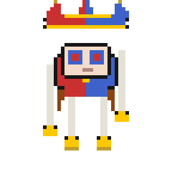
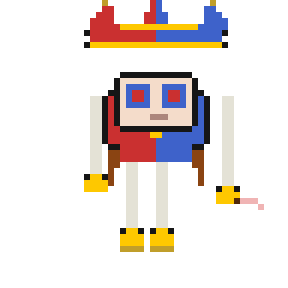
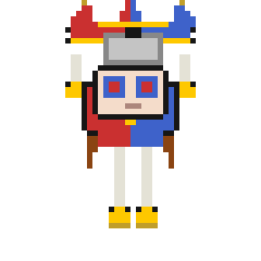
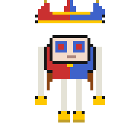

# CLI Avatars

Animated pixel-art characters that live on your desktop and react to your active **Claude Code** sessions in real time.

Each avatar represents one running agent. It walks on top of your open windows, speeds up when the agent is using a tool, and dangles as a sub-agent when a sub-task spawns. No browser, no VS Code extension — just a Python script you run once.

---

<p align="center">
  
  
  
  
</p>

<p align="center">
  <em>walk · type (tool use) · read · idle</em>
</p>

---

## What It Does

- **One avatar per Claude Code session** — spawns and despawns automatically as you open and close Claude terminals
- **Window terrain** — avatars walk on the top edges of your open windows (VS Code, browser, terminal, etc.)
- **Wall climbing** — avatars randomly latch onto window edges and climb up
- **Status-reactive** — animation row changes based on what the agent is doing (idle, busy, thinking, subagent)
- **Subagent physics** — when a Task sub-agent spawns, a child avatar appears and hangs from the parent via an elastic spring line
- **Skin picker** — pick any loaded sprite sheet and hue-shift it per agent, live
- **No sessions = single idle avatar** — Caine appears when no Claude sessions are running

---

## Quick Start

**Requirements:** Python 3.10+, Windows (Linux/macOS partial support)

```bash
# 1. Clone
git clone https://github.com/ryuustark/cli-avatars.git
cd cli-avatars

# 2. Install dependencies
pip install -r requirements.txt

# 3. Run
python overlay.py
```

Right-click on screen → **Quit**, or press **ESC**.

---

## Controls

| Action | Result |
|--------|--------|
| Right-click avatar | Focus that agent's terminal window |
| Right-click empty area | Open context menu (Skins / Config / Status / Quit) |
| Drag HUD panel | Reposition the status box |
| ESC | Quit |

---

## Skin Picker

Right-click → **Skins** to open the skin picker:

```
[ Agent: caine ▼                    ]
[ Hue: 0° ─────────────────── 360° ]
[ Preview: [■■■■] 64×64 thumbnail   ]

  ○  bubble
  ●  caine       ← selected (blue highlight)
  ○  meowatar
  ○  amongo
  ○  michimaru

[ Apply ]
```

- **Hue slider** — rotates all colors of the sprite. Preview updates live.
- **Skin list** — click a row to select. Click **Apply** to assign.
- Per-agent assignment: each agent can have its own skin and hue.

---

## Available Skins

| Name | Type | Notes |
|------|------|-------|
| `caine` | Auto-generated | Stick-figure character (default) |
| `bubble` | Auto-generated | Round bubble character |
| `amongo` | Auto-generated | Among-Us-style cat |
| `meowatar` | `Sprites/meowatar.png` | Stream Avatars format, 60×50 cell |
| `michimaru` | `Sprites/Michimaru.png` | Stream Avatars format, 40×51 cell |
| `ponmi` | `Sprites/ponmi.png` | Stream Avatars format, 48×48 cell |

---

## Adding Your Own Skin

Any sprite sheet in **Stream Avatars row format** works. Full guide: [docs/adding-sprites.md](docs/adding-sprites.md)

**TL;DR:**

1. Place a `.png` sprite sheet in `Sprites/`
2. Add one line to the `sheets` list in `_load_sprites()` inside `overlay.py`:
   ```python
   ("myskin", "MySkin.png", frame_width, frame_height),
   ```
3. Restart — your skin appears in the picker immediately.

Row convention:

| Row | Animation | When shown |
|-----|-----------|------------|
| 0 | idle | Agent waiting |
| 1 | run / walk | Agent using a tool (busy) |
| 2 | sit | Agent thinking / waiting for response |
| 3 | stand | Done / error |
| 4 | jump | Sub-agent active |

---

## Claude Code Hooks (Real-Time Events)

By default, the overlay polls JSONL session files every 2 seconds. For instant status updates, drop `claude_hooks_example.py` into your project's `.claude/hooks/` folder. Full guide: [docs/claude-hooks.md](docs/claude-hooks.md)

---

## Dependencies

```
pillow      # image loading, hue rotation, sprite rendering
pywinctl    # open window positions (terrain). Optional — falls back to screen floor.
numpy       # hue rotation math. Optional — skips hue shift if missing.
pystray     # system tray icon. Optional — falls back to right-click menu.
```

```bash
pip install -r requirements.txt
```

---

## Project Structure

```
cli-avatars/
├── overlay.py              ← Entry point — run this
├── sprite_loader.py        ← Sprite sheet loader (SpriteSheet, SpriteRegistry)
├── claude_hooks_example.py ← Drop into .claude/hooks/ for instant events
├── gen_ponmi.py            ← Generator for the ponmi sprite sheet
├── requirements.txt
├── Sprites/                ← PNG sprite sheets
│   ├── caine.png
│   ├── bubble.png
│   ├── meowatar.png
│   ├── michimaru.png
│   └── ponmi.png
├── ponmi_preview/          ← GIF previews of animations
└── docs/
    ├── adding-sprites.md   ← How to add custom skins
    └── claude-hooks.md     ← How to use the hooks integration
```

---

## Roadmap

| Version | Focus |
|---------|-------|
| v0.4 ✅ | Real sprite sheets, skin picker, hue shift, wall climbing, subagent spring physics |
| v0.5 | UDP hook listener, emotion bubbles, avatar-to-avatar interaction |
| v0.6 | System tray, sound effects, config file |
| v1.0 | Tauri port — cross-platform binary, no Python required |

Full task board: [TASKS.md](TASKS.md)

---

## License

MIT — see [LICENSE](LICENSE) if present, otherwise treat as free to use and modify.
